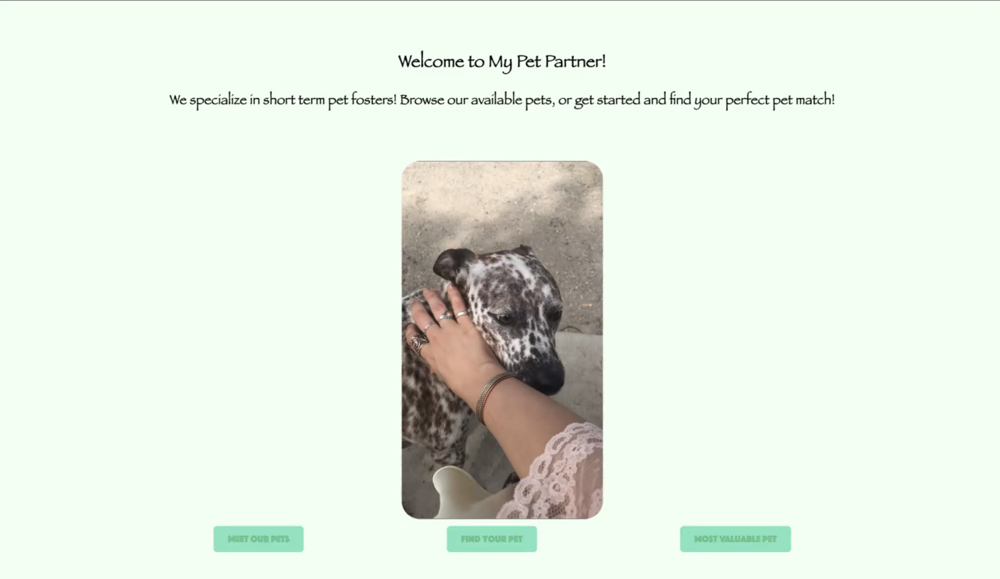
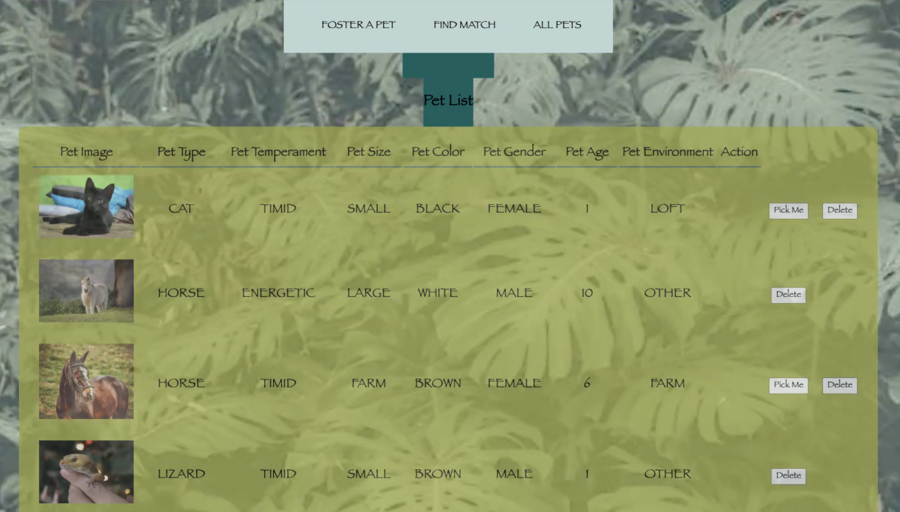
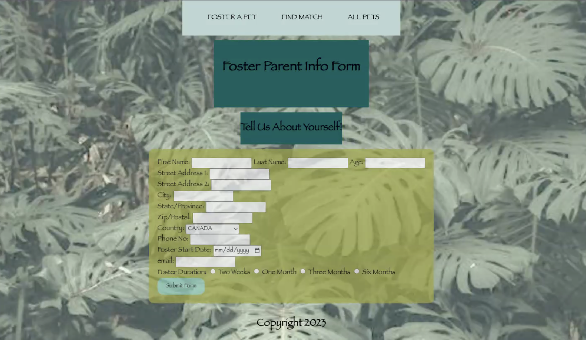
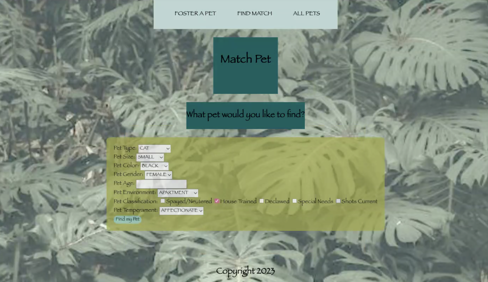
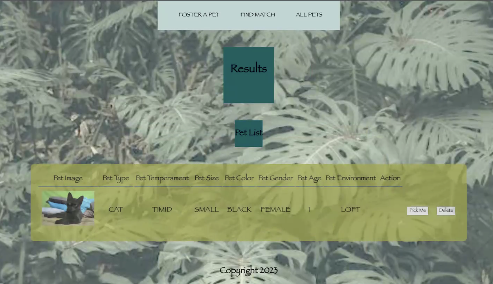

# Pet Partner - Let's find your next short-term pet foster!

Welcome to the Pet Partner Admin App, an Express Application which leverages Mongoose.  The Pet Partner application offers a staff/admin model as well as an end-user model.  The end-user Pet Partner model caters to short-term pet fosters by matching their preferred pet characteristcs against a growing inventory of available pets to provide them with the perfect match, while the staff/admin model allows for various adminstrative functions such as adding and removing pets from inventory as well as adding user profiles.

## End User Application

The user will be prompted to log-in using the OAuth (Open Authorization) authentication protocol.  Alternatively, the user can complete a form which captures the users key demographics which is then retained in the mongodb. The form captures such data as the first name, last name, email address, phone number, address including street, city, state/province postal/zipcode, country, age, date they would like to begin fostering, and length of the foster.

Upon completing and submitting the user profile/information the user will be prompted to complpete a form which consists of various pet attributes.  The input from this form is used as the primary mechanism to match the users requirements with the available pets in the mongodb.  Users can enter the pet type (i.e. Dog, Cat, etc), pet size, (i.e. small, medium, large), pet color, pet temperament, pet age, pet gender, and pet classifications such as spayer/neutered, declawed, etc.  

When this form is submitted the user will be matched to one of the available pets in the database who is either an exact match or within the same pet type category.

Next, the user can chose to select a pet by clicking the 'Pick Me' button, which then removes the pets availability from the mongodb and then presents the end user with a confirmation of their foster, including the users contact information, foster start date, length and pet information.

## Admin/Staff Application

The Admin/Staff application will allow the user to delete pets from the database by clicking the delete button, it will also allow the user to add new pets and add new user information.  

# Screenshots

- Landing Page:

- All Pets:

- User Profile Form:

- Pet Match Form:

- Match Results:

- Invoice/Confirmation:

# Technologies Used:
- Javascript
- Express
- Mongoose
- Mongodb
- Nodejs
- OAuth
- CSS / HTML

# Getting Started:

Navigate to the following:  <deployment URL>

# Fast Follow Items/Future Enhancements
- Widen match criteria to include best match, sorted from closest to least
- Select mulitple fosters on the results page
- leverage pet**** API to use real animals
- CSS updates to add more polish to the experience